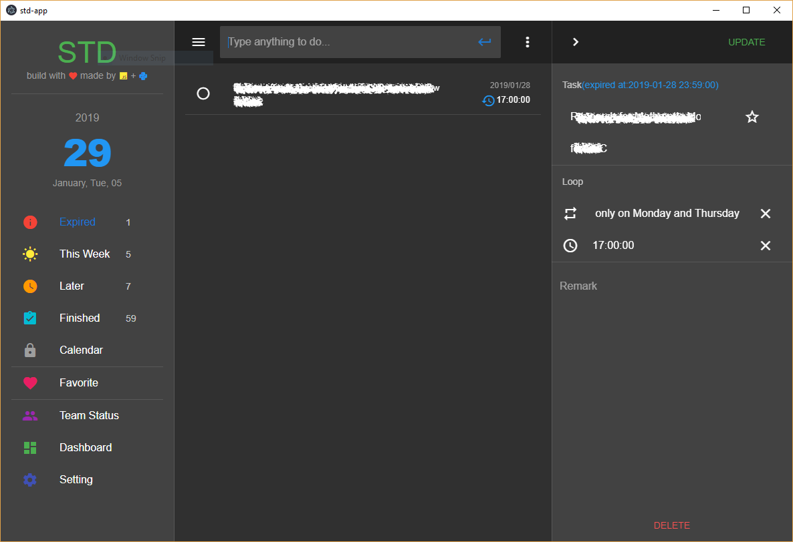

# std
STD means *standard*, it's developed for promoting **Leader Standard Work**, inspired by many apps like *Microsoft To Do* aim to help to arrange recurrence works but also available for one-time tasks.

It's developed by `vue.js` & `vuetify` framework and pack by `electron` which require **vue-cli3** & **electron-vuetify** boilerplate.
## Gallery(desktop version)

## Project setup
install necessary packages
```
npm install
```
run in debug mode
```
npm run dev
```
yarn is recommended yet you need edit the `package.json` script first
## Notice
It's not a standalone app which required a backend, you can edit
from repository [std-api](https://www.github.com/NegativeDearc/std-api) which writen by Python.

Desktop version mainly for windows can be found at [std-app](https://www.github.com/NegativeDearc/std-app).
